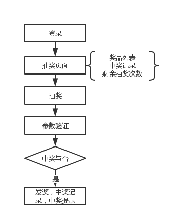
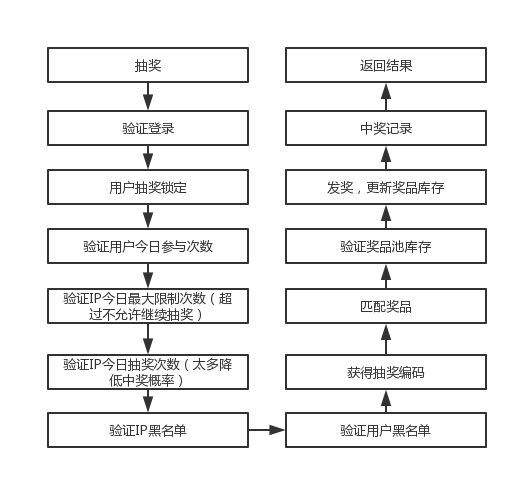
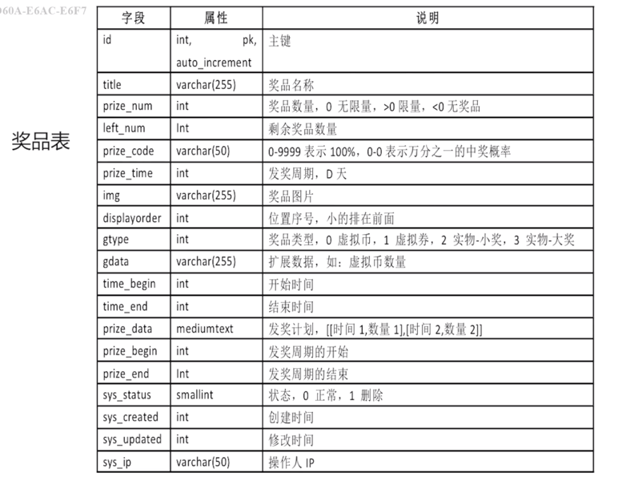
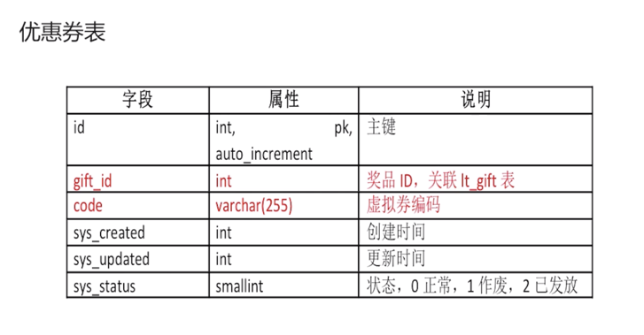
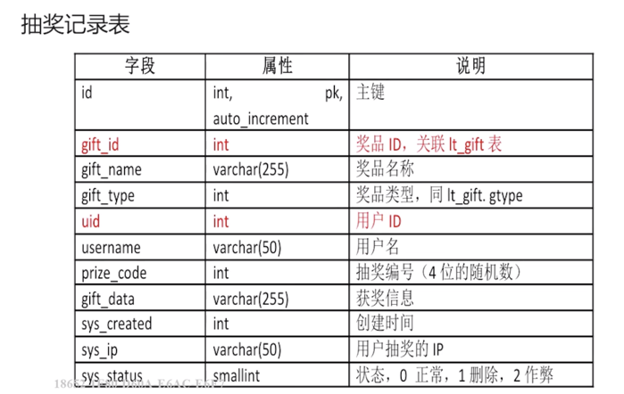
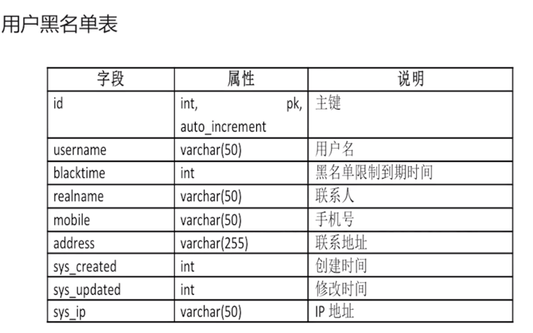
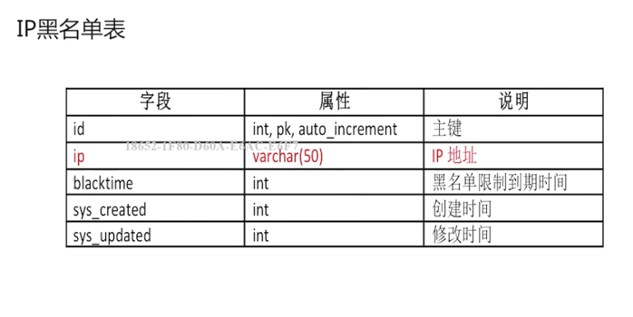
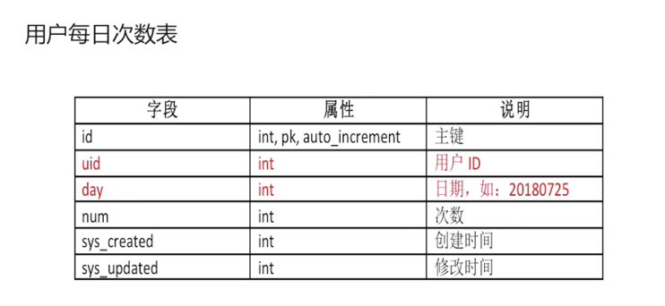
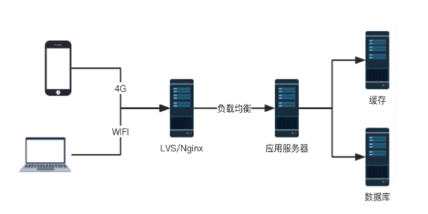
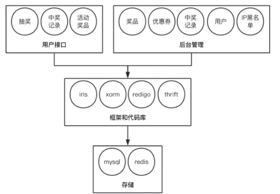

# 需要的系统
## 前端抽奖页面
* 交互效果，大转盘
* 用户登录，每天抽奖次数限制
* 获奖提示和中奖列表
## 后端接口
* 登录
* 奖品列表
* 抽奖
* 中奖列表
* 高性能，高并发
* 安全，不能超发，合理均匀发放
## 后台管理
* 基本数据管理：奖品，优惠券，用户，IP 黑名单，中奖记录
* 实时更新奖品信息，更新奖品库存，奖品中奖周期等
* 后台定时任务，生成发奖计划，填充奖品池

# 用户操作和业务流程
## 用户操作

## 业务流程


# 表设计
## 奖品表

## 优惠券表

## 抽奖记录表

## 用户黑名单表

## IP 黑名单表

## 用户每日次数表

# 缓存设计
## 缓存使用注意事项
* 提高系统性能，减少数据库依赖
* 平衡好“系统性能、开发时间、复杂度”
* 适合数据读多写少，数据量有限，数据分散的情况

## 系统中使用 redis 缓存的地方
* 奖品，数量少，更新频率低，最佳的全量缓存对象
* 优惠券，一次性导入，编码为 set 类型
* 中奖记录，读写差不多，可以缓存部分统计数据，如：最新中奖记录，最新大奖发放记录
* 用户黑名单，读多写少，可以按照 uid 散列
* IP 黑名单，按照 ip 散列
* 用户每日参与次数

# 系统架构设计
## 网络架构
* 负载均衡层
* 应用层
* 存储层

## 系统架构
* 业务层
* 框架层
* 存储层


# 项目目录结构
```bash
├── bootstrap          // 应用启动相关
├── comm               // 公共的函数
├── conf               // 配置
├── cron               // 定时任务
├── dao                // 数据库操作
├── datasource         // 数据源
├── models             // 数据模型
├── services           // 数据服务，调用 dao 中的代码，也可能使用缓存，也可能调用第三方接口
├── thrift             // rpc 相关
└── web
    ├── controllers    // 控制器
    ├── main.go
    ├── middleware     // 中间件
    │   └── identity   // 身份识别
    ├── public         // 静态资源文件
    ├── routes         // 路由
    ├── viewmodels     // 模板数据模型
    └── views          // 模板
        ├── admin      // 后台
        └── shared     // 公共
```

# 数据模型生成
## 使用 xorm-cmd
```
go get github.com/go-xorm/cmd/xorm

cd $GOPATH/src/github.com/go-xorm/cmd/xorm

go build

./xorm reverse mysql root:123456@tcp(127.0.0.1:3306)/lottery?charset=utf8 templates/goxorm
```

会在 `models` 下生成代码，将其拷贝到项目中即可。

# 项目基础代码
## 连接数据库
数据库连接在整个项目中应该是一个单例，所以在 `datasource/dphelper.go` 中使用了单例模式：
```go
var masterInstance *xorm.Engine
var dbLock sync.Mutex

func InstanceDbMaster() *xorm.Engine {
	if masterInstance != nil {
		return masterInstance
	}
	dbLock.Lock()
	defer dbLock.Unlock()
	// 这里要再次判断，否则仍然会多次调用 NewDbMaster
	if masterInstance != nil {
		return masterInstance
	}
	return NewDbMaster()
}

func NewDbMaster() *xorm.Engine {
	sourcename := fmt.Sprintf("%s:%s@tcp(%s:%d)/%s?charset=utf8",
		conf.DbMaster.User,
		conf.DbMaster.Pwd,
		conf.DbMaster.Host,
		conf.DbMaster.Port,
		conf.DbMaster.Database)
	instance, err := xorm.NewEngine(conf.DriverName, sourcename)
	if err != nil {
		log.Fatal("dbhelper.NewDbMaster: NewEngine error", err)
	}
	instance.ShowSQL(true)
	masterInstance = instance
	return instance
}
```
注意，这里的单例模式因为需要考虑到多协程的情况，有点特殊，在调用 `NewDbMaster` 之前需要再次检查 `masterInstance`。否则，仍然会新建多个数据库连接，可以通过下面这段代码来验证:

```go
package main

import (
	"fmt"
	"sync"
)

type Cls struct {}
var instance *Cls
var dbLock sync.Mutex

func GetInstance() *Cls {
	if instance != nil {
		return instance
	}
	dbLock.Lock()
	defer dbLock.Unlock()
	return NewInstance()
}

func NewInstance() *Cls {
	fmt.Println("new instance")
	instance = &Cls{}
	return instance
}

func main() {
	for i := 0; i < 100; i++ {
		go GetInstance()
	}
}

```

## 数据服务
### dao
DAO 是数据访问层，以 `GiftDao`, DAO 首先要有数据库连接的实例，然后对外提供一个工厂函数以及一些查询函数：
```go
type GiftDao struct {
	engine *xorm.Engine
}

func NewGiftDao(engine *xorm.Engine) *GiftDao {
	return &GiftDao{engine}
}

func (d *GiftDao) Get(id int) *models.LtGift {
	data := &models.LtGift{Id: id}
	ok, err := d.engine.Get(data) // it will modify the data
	if ok && err == nil {
		return data
	} else {
		data.Id = 0 // to keep the same return
		return data
	}
}
...
```

### service
servie 是业务层，以 `GiftService` 为例，service 是一个接口，抽象了业务层的一些功能，不关心具体的实现，你可以从数据库里面拿数据，也可以调用第三方接口拿数据，这样就使得我们的开发更加灵活。
```go
type GiftService interface {
	GetAll() []models.LtGift
	CountAll() int64
	Get(id int) *models.LtGift
	Delete(id int) error
	Update(data *models.LtGift, columns []string) error
	Create(data *models.LtGift) error
}

// 实现 service
type giftService struct {
	dao *dao.GiftDao
}
func (s *giftService) GetAll() []models.LtGift {
	return s.dao.GetAll()
}
...
func NewGiftService() GiftService {
	return &giftService{
		dao: dao.NewGiftDao(datasource.InstanceDbMaster()),
	}
}

```

# Bootstrapper
`Bootstrapper` “继承” 自 `iris.Application`，且新增了一些参数:

```go
type Bootstrapper struct {
	*iris.Application
	AppName      string
	AppOwner     string
	AppSpawnDate time.Time
}
// 工厂函数
func New(appName, appOwner string, cfgs ...Configurator) *Bootstrapper {
	b := &Bootstrapper{
		Application:  iris.New(),
		AppName:      appName,
		AppOwner:     appOwner,
		AppSpawnDate: time.Now(),
	}
	for _, cfg := range cfgs {
		cfg(b)
	}
	return b
}
// 初始化函数
func (b *Bootstrapper) Bootstrap() *Bootstrapper {
	b.SetupViews("./views")
	b.SetupErrorHandlers()
	b.Favicon(StaticAssets + Favicon)
	b.StaticWeb(StaticAssets[1:len(StaticAssets)-1], StaticAssets)
	b.setupCron()
	b.Use(recover.New())
	b.Use(logger.New())
	return b
}
// 启动服务
func (b *Bootstrapper) Listen(addr string, cfgs ...iris.Configurator) {
	b.Run(iris.Addr(addr), cfgs...)
}
```

# controller
在 `web/controllers` 下定义首页的控制器，控制器需要 “继承” `iris.Context` 并持有 `GiftService` 实例：

```go
package controllers

import (
	"github.com/kataras/iris"
	"imooc_go_lottery/models"
	"imooc_go_lottery/services"
)

type IndexController struct {
	Ctx iris.Context
	GiftService services.GiftService
}

func (c *IndexController) Get() string {
	c.Ctx.Header("Content-Type", "text/html")
	return "welcome to Go抽奖系统，<a href='/public/prize.html'>开始抽奖</a>"
}

func (c *IndexController) GetGifts() map[string]interface{} {
	rs := make(map[string]interface{})
	rs["code"] = 0
	rs["msg"] = ""
	datalist := c.GiftService.GetAll()
	var list []models.LtGift
	for _, data := range datalist {
		if data.SysStatus == 0 {
			list = append(list, data)
		}
	}
	rs["gifts"] = list
	return rs
}
```

# 路由配置
`iris` 支持依赖注入，需要 `Register` 所需的服务：
```go
import (
	"github.com/kataras/iris/mvc"
	"imooc_go_lottery/bootstrap"
	"imooc_go_lottery/services"
	"imooc_go_lottery/web/controllers"
)

func Configure(b *bootstrap.Bootstrapper) {
	giftService := services.NewGiftService()

	index := mvc.New(b.Party("/"))
	index.Register(giftService)
	index.Handle(new(controllers.IndexController))
}
```

# main
有了前面的铺垫，启动一个服务就很简单了:
```go
package main

import (
	"fmt"
	"imooc_go_lottery/bootstrap"
	"imooc_go_lottery/web/routes"
)

var port = 8080

func newApp() *bootstrap.Bootstrapper {
	app := bootstrap.New("抽奖系统", "ayou")
	app.Bootstrap()
	app.Configure(routes.Configure)
	return app
}

func main() {
	app := newApp()
	app.Listen(fmt.Sprintf(":%d", port))
}

```

